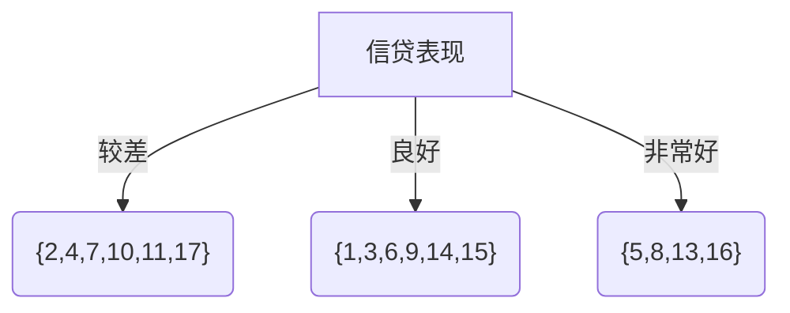

---
# 这是文章的标题
title: CART决策树原理（分类树与回归树）
# 你可以自定义封面图片
cover: /assets/images/cover1.jpg
# 这是页面的图标
icon: fa-solid fa-file-lines
# 这是侧边栏的顺序
order: 3
# 设置作者
author: Mr.Chuzs
# 设置写作时间
date: 2024-05-08
# 一个页面可以有多个分类
category:
  - 机器学习
# 一个页面可以有多个标签
tag:
  - 算法
  - 机器学习
  - 大数据
# 此页面会在文章列表置顶
sticky: false
# 此页面会出现在文章收藏中
star: true
# 你可以自定义页脚

#footer: 你走的每一步都算数
# 你可以自定义版权信息
#copyright: Copyright © 2023 Mr.Chuzs
---

`more` CART 决策树原理（分类树与回归树）

<!-- more -->

决策树在很多公司都实际运用于风险控制

## 一、CART 树理解

CART(classification and regression tree)树：又称为分类回归树，从名字可以发现，CART 树既可用于分类，也可以用于回归。
当数据集的因变量是离散值时，可以采用 CART 分类树进行拟合，用叶节点概率最大的类别作为该节点的预测类别。
当数据集的因变量是连续值时，可以采用 CART 回归树进行拟合，用叶节点的均值作为该节点预测值。
但需要注意的是，该算法是一个二叉树，即每一个非叶节点只能引伸出两个分支，所以当某个非叶节点是多水平(2 个以上)的离散变量时，该变量就有可能被多次使用。
为了大家对 CART 树有一个更清晰的理解，先放一张理解图：

::: tabs#flowchart

@tab plantuml#plantuml

::: center
@startuml
agent "CART 决策树" as a1
agent "分类 CART 决策树" as a2
agent "回归 CART 决策树" as a3
agent "1.特征选择\r（基尼指数）" as a4
agent "2.树的生成" as a5
agent "4.剪枝" as a6
agent "1.特征选择\r（残差平方和）" as a7
agent "2.树的生成" as a8
agent "3.剪枝" as a9

a1 -->> a2
a1 -->> a3
a2 -->> a4
a2 -->> a5
a2 -->> a6
a3 -->> a7
a3 -->> a8
a3 -->> a9
@enduml

@tab mermaid#mermaid

:::

从上图知 CART 决策树分为分类 CART 树和回归 CART 树，只是在特征选择时一个采用基尼指数，一个采用残差平方和。

## 二 分类 CART 树生成

### 1 基尼指数(Gini index)

假设数据集$D$中有$K$个类，样本属于第 K 类的概率为$p_k$，基尼指数$Gini(D)$表示集合$D$的不确定性(纯度)，公式如下：

$$
Gini(D)=\sum\limits_{k=1}^K p_k(1-p_k)=1-\sum\limits_{k=1}^K p_k^2
$$

从上面的公式可以发现，当数据集$D$中只有 1 个类时，$p_k=1$，$Gini(D)=0$，说明**基尼指数越小，样本纯度越高**。

对于特征 A，将集合$D$划分成$D1$和$D2$，基尼指数$Gini(D,A)$表示经过$A=a$划分后集合$D$的不确定性，公式如下：

$$
Gini(D,A)=\frac{|D_1|}{D}Gini(D_1)+\frac{|D_2|}{|D|}Gini(D_2)
$$

其中$|D|$、$|D1|$、$|D2|$分别表示数据集$D$、$D1$、$D2$中样本数量。

### 2 应用基尼指数生成 CART 决策树实例

::: center
**表 1** **贷款申请样本数据表**
:::

| 编号 | X:年龄 | X:是否有工作（1:是，2:否） | X:是否买房（1:是，2:否） | X:信贷表现 | 是否放贷（1:是，2:否） |
| :--: | :----: | :------------------------: | :----------------------: | :--------: | :--------------------: |
|  1   |  青年  |             0              |            0             |    一般    |           0            |
|  2   |  青年  |             0              |            0             |     好     |           0            |
|  3   |  青年  |             1              |            0             |     好     |           1            |
|  4   |  青年  |             1              |            1             |    一般    |           1            |
|  5   |  青年  |             0              |            0             |    一般    |           0            |
|  6   |  中年  |             0              |            0             |    一般    |           0            |
|  7   |  中年  |             0              |            0             |     好     |           0            |
|  8   |  中年  |             1              |            1             |     好     |           1            |
|  9   |  中年  |             0              |            1             |   非常好   |           1            |
|  10  |  中年  |             0              |            1             |   非常好   |           1            |
|  11  |  老年  |             0              |            1             |   非常好   |           1            |
|  12  |  老年  |             0              |            1             |     好     |           1            |
|  13  |  老年  |             1              |            0             |     好     |           1            |
|  14  |  老年  |             1              |            0             |   非常好   |           1            |
|  15  |  老年  |             0              |            0             |    一般    |           0            |

首先计算各特征的基尼指数，选择最优特征以及最优切分点。为了公式的简洁，分别以$A1$、$A2$、$A3$、$A4$表示年龄、是否有工作、是否买房、信贷表现。

首先求特征 $A1$ 的基尼指数，$A1$中有三个类别：青年、中年、老年，样本数量都是 5，根据公式

$$
Gini(D,A)=\frac{|D_1|}{D}Gini(D_1)+\frac{|D_2|}{|D|}Gini(D_2)
$$

假设要求 $Gini(D,A1=\text{青年})$的值，其中$|D|$表示整个数据集中样本个数，从编号知值为 15，$|D1|$表示年龄是青年的样本个数，值为 5，$|D2|$表示年龄不是青年的样本个数，值为 10。

$Gini(D1)$表示青年这个类别的基尼指数，对应的 $Y$ 有两种可能，一种是放贷(1)，另一种是不放贷(0)，代入公式可得：

$$
Gini(D_1)=\frac{2}{5}*(1-\frac{2}{5})+\frac{3}{5}*(1-\frac{3}{5})
$$
