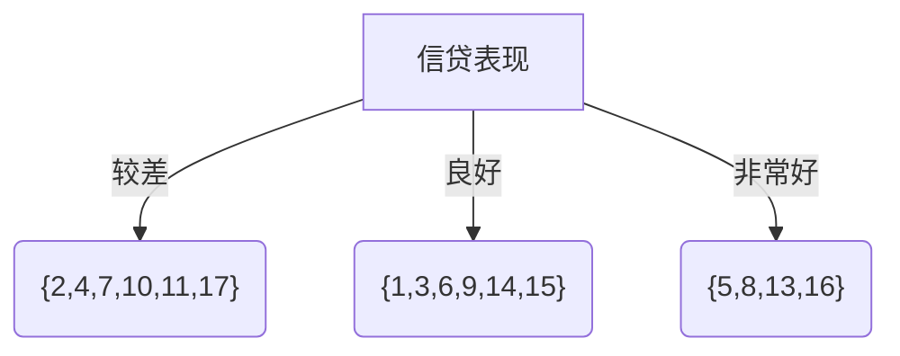
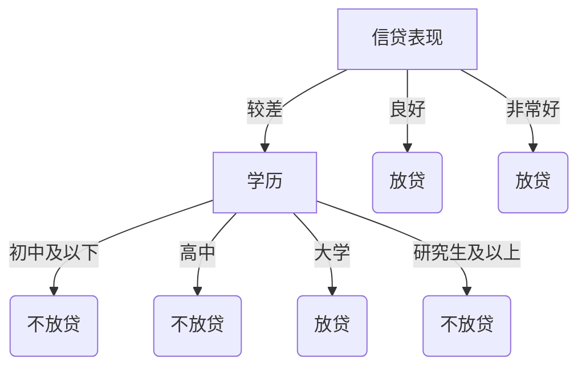

---
# 这是文章的标题
title: ID3算法
# 你可以自定义封面图片
cover: /assets/images/cover2.jpg
# 这是页面的图标
icon: fa-solid fa-file-lines
# 这是侧边栏的顺序
order: 1
# 设置作者
author: Mr.Chuzs
# 设置写作时间
date: 2024-04-26
# 一个页面可以有多个分类
category:
  - 机器学习
# 一个页面可以有多个标签
tag:
  - 算法
  - 机器学习
  - 大数据
# 此页面会在文章列表置顶
sticky: false
# 此页面会出现在文章收藏中
star: true
# 你可以自定义页脚

#footer: 你走的每一步都算数
# 你可以自定义版权信息
#copyright: Copyright © 2023 Mr.Chuzs
---

`more` ID3算法

<!-- more -->

## 1 什么是熵

熵度量了事物的不确定性，越不确定的事物，熵越大。
随机变量X的熵公式如下：
$$
H(X)=-\sum\limits_{i}^np_ilogp_i
$$
其中$n$表示随机变量$X$的$n$种不同离散取值，$p_i$表示$X$取值为i的概率，$log$表示以2为底或以e为底的对数。
假设随机变量$X$表示掷一枚硬币的结果，它有两种可能的取值，正面或反面，各占$\frac{1}{2}$，这时随机变量$X$的熵为：
$$
H(X)=-\sum_{i}p_ilogp_i=-(\frac{1}{2}*log\frac{1}{2}+\frac{1}{2}*log\frac{1}{2})=log2
$$
假设随机变量$X$表示掷一枚骰子的结果，它有六种可能的取值，{1,2,3,4,5,6}，各占$\frac{1}{6}$，这时随机变量$X$的熵为：
$$
H(X)=-\sum_{i}p_ilogp_i=-(\frac{1}{6}*log\frac{1}{6}*6)=log 6
$$
掷一枚骰子的不确定性比掷一枚硬币的不确定性大，熵值也大。
了解了熵的概念，下面我们详细介绍ID3算法。

## 2 ID3算法

在决策树的每一个节点，我们都要选择最优的特征进行分裂。那么怎么定义在该次分裂中该特征是最优选择？
ID3算法采用信息增益来衡量变量是不是最优的。我们$Gain(D,a)$来表示信息增益，具体公式如下：
$$
Gain(D,a)=Ent(D)-\sum\limits_{i=1}^n \frac{|D^v|}{|D|}Ent(D^v)
$$
其中$D$表示当前样本集合，$a$表示某个特征，$Ent(D)$表示信息熵，$|D|$表示样本集合中样本数量$|D^v|$表示特征$a$中$v$类样本数量，$Ent(D^v)$表示$v$类样本信息熵。
若当前样本集合$D$中总共有$K$类，其中第$k$类的样本所占比例为$p_k$，则$D$的信息熵公式如下：
$$
Ent(D)=-\sum\limits_{k=1}^k p_klog_2p_k
$$
为了更清晰地理解信息增益公式，以及决策树如何选择特征，我们看一个构造的简单例子：

| 编号  |     学历     | 是否有房 | 信贷表现 | 是否房贷 |
| :---: | :----------: | :------: | :------: | :------: |
|   1   |  初中及以下  |    有    |   良好   |    是    |
|   2   |  初中及以下  |    无    |   较差   |    否    |
|   3   |  初中及以下  |    有    |   良好   |    是    |
|   4   |  初中及以下  |    有    |   较差   |    否    |
|   5   |     高中     |    无    |  非常好  |    是    |
|   6   |     高中     |    有    |   良好   |    是    |
|   7   |     高中     |    有    |   较差   |    否    |
|   8   |     高中     |    有    |  非常好  |    是    |
|   9   |     高中     |    无    |   良好   |    是    |
|  10   |     高中     |    无    |   较差   |    否    |
|  11   |     大学     |    有    |   较差   |    否    |
|  12   |     大学     |    有    |   良好   |    是    |
|  13   |     大学     |    有    |  非常好  |    是    |
|  14   |     大学     |    无    |   良好   |    是    |
|  15   | 研究生及以上 |    有    |   良好   |    是    |
|  16   | 研究生及以上 |    有    |  非常好  |    是    |
|  17   | 研究生及以上 |    无    |   较差   |    否    |

正例(放贷)占$\frac{11}{17}$，反例占$\frac{6}{17}$，根节点的信息熵为：
$$
Ent(D)=-\sum\limits_{k=1}^k p_klog_2p_k=-(\frac{11}{17} log_2\frac{11}{17}+\frac{6}{17} log_2\frac{6}{17})=0.936
$$
计算当前特征集合{学历，是否有房子，信贷表现}中每个特征的信息增益，选择信息增益最大的特征进行分裂。

学历有4个可能取值：\{初中及以下，高中，大学，研究生及以上\}
D1(学历=初中及以下)={1，2，3，4}，正例2/4，反例2/4。
D2(学历=高中)={5，6，7，8，9，10}，正例4/6，反例2/6。
D3(学历=大学)={11，12，13，14}，正例3/4，反例1/4。
D4(学历=研究生及以上)={15，16，17}，正例2/3，反例1/3。
4个分支节点的信息熵为：
$$
Ent(D^1)=-(\frac{2}{4} log_2\frac{2}{4}+\frac{2}{4} log_2\frac{2}{4})=1
$$
$$
Ent(D^2)=-(\frac{4}{6} log_2\frac{4}{6}+\frac{2}{6} log_2\frac{2}{6})=0.918
$$
$$
Ent(D^3)=-(\frac{3}{4} log_2\frac{3}{4}+\frac{1}{4} log_2\frac{1}{4})=0.811
$$
$$
Ent(D^4)=-(\frac{1}{3} log_2\frac{1}{3}+\frac{2}{3} log_2\frac{2}{3})=0.918
$$
则学历的信息增益为：
$$
Gain(D, \text{学历})=Ent(D)-\sum\limits_{v=1}^n\frac{|D^v|}{|D|}Ent(D^v)
$$
$$
\begin{aligned}
=&0.936-(\frac{4}{17}*1+\frac{6}{17}*0.918+\frac{4}{17}*0.811+\frac{3}{17}*0.918)\\
=&0.024
\end{aligned}
$$
同理，可以算出其它两个特征的信息增益。
$$
Gain(D, \text{是否有房子})=0.324
Gain(D, \text{信贷表现})=0.706
$$
我们发现
$$
Gain(D, \text{信贷表现})>Gain(D, \text{是否有房子})>Gain(D, \text{学历})
$$
所以根节点我们选择的划分特征为“信贷表现”。

::: tabs#flowchart

@tab plantuml#plantuml

::: center
@startuml
agent "信贷表现" as a1
agent "{2,4,7,10,11,17}" as a2
agent "{1,3,6,9,14,15}" as a3
agent "{5,8,13,16}" as a4

a1 -->> a2 : 较差
a1 -->> a3 : 良好
a1 -->> a4 : 非常好
@enduml

@tab mermaid#mermaid

:::

从而可以得到三个子节点。对于这三个节点，可以递归地使用信息增益寻找最优划分特征，进行进一步的分裂，从而建立最终的决策树。
在该文章的实例中，信贷表现良好和非常好的样本最终都放贷了。说明这两个子节点中的样本非常纯。
现实数据可能远比实例中的数据复杂，不是信贷表现良好就一定会放贷。有些信贷表现好，也可能是养的信贷数据，还要从别的维度去佐证这个客户有能力且有意愿还贷，才会最终给这个客户放贷。
接下来对第一个分支结点：D1(信贷表现=较差)={2,4,7,10,11,17}，计算当前特征集合{学历，是否有房子}中每个特征的信息增益，选择信息增益最大的特征进行分裂。
当前结点正例(放贷)占1/6，反例占5/6，当前节点的信息熵为：
$$
Ent(D^1)=-\sum\limits_{k=1}^2p_k\log_2p_k=-(\frac{1}{6}log_2\frac{1}{6}+\frac{5}{6}log_2\frac{5}{6})=0.65
$$

学历有4个可能取值：{初中及以下，高中，大学，研究生及以上}
D11(学历=初中及以下)={2，4}，正例0/2，反例2/2。
D12(学历=高中)={7，10}，正例0/2，反例2/2。
D13(学历=大学)={11}，正例1/1，反例0/1。
D14(学历=研究生及以上)={17}，正例0/1，反例1/1。
4个分支节点的信息熵为：
$$
Ent(D^{11})=-(\frac{2}{2}log_2\frac{2}{2})=0
$$
$$
Ent(D^{12})=-(\frac{2}{2}log_2\frac{2}{2})=0
$$
$$
Ent(D^{13})=-(\frac{1}{1}log_2\frac{1}{1})=0
$$
$$
Ent(D^{14})=-(\frac{1}{1}log_2\frac{1}{1})=0
$$

那么当前分支节点特征学历的信息熵为：

$$
Gain(D^1,\text{学历})=0.65-(\frac{2}{6}*0+\frac{2}{6}*0+\frac{1}{6}*0+\frac{1}{6}*0)=0.65
$$

同理可以求出特征是否有房子的信息熵为：

$$
Gain(D^1,\text{是否有房})=0.65-(\frac{3}{6}*0.918+\frac{3}{6}*0)=0.191
$$

可以发现

$$
Gain(D^1,\text{学历}) > Gain(D^1,\text{是否有房})
$$

于是我们选择学历作为当前划分特征，得到最终的决策树如下：

::: tabs#flowchart

@tab plantuml#plantuml

::: center
@startuml
agent "信贷表现" as a1
agent "学历" as a2
agent "放贷" as a3
agent "放贷" as a4
agent "不放贷" as a5
agent "不放贷" as a6
agent "放贷" as a7
agent "不放贷" as a8

a1 -->> a2 : 较差
a1 -->> a3 : 良好
a1 -->> a4 : 非常好
a2 -->> a5 : 初中及以下
a2 -->> a6 : 高中
a2 -->> a7 : 大学
a2 -->> a8 : 研究生及以上
@enduml

@tab mermaid#mermaid

:::

从上面的结果可以发现，对于信贷表现较差的客户，学历是初中及以下和高中的都拒绝了，学历是大学的放贷了，学历是研究生的拒绝了(为什么大学学历可以放贷，研究生学历却不行？)。
从这里可以看出，用信息增益准则虽然可以构建出一颗决策树，通过这颗树可以对新进来的样本进行最终的决策(放贷或拒绝）。
但是这样的决策树存在一些问题。

## 3 ID3算法的缺点

从求解信息增益的公式中可以看出，信息增益准则对取值类别较多(分的类别越多，分到每一个子节点的样本数量越少，子节点是同一个类别的可能性越大)的特征有所偏好。
假设实例数据集中的编号也是一个候选划分特征，那么该特征的每一个类别中只有一个样本(非常纯)。
所有分支节点的信息熵都为0，该节点的信息增益就为根节点的信息熵，值为0.936，大于特征信贷表现的信息增益0.706。
应该选择编号建立决策树？
显然，这样生成的决策树不具备泛化能力。
而且ID3算法没有考虑连续特征，比如长度是连续值，无法使用ID3算法。
同样的，对于缺失值和过拟合也都没有考虑，只是寻找信息增益最大的特征进行划分。
那我们要如何改进这个算法？
